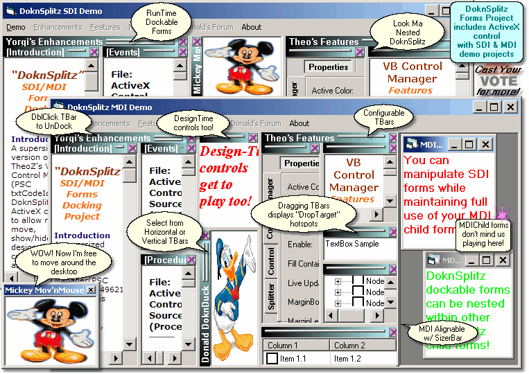



## DoknSplitz \- SDI/MDI Forms Docking Project

### Description

DoknSplitz is an ActiveX control which integrates resize, move, show/hide of design time controls as well as provide runtime forms docking &amp; undocking capability for SDI/MDI apps.&#160;This project is a supersized version of TheoZ's VB Control Manager(txtCodeId=49621). Special care taken to ensure backward compatibility with TheoZ's events &amp; properties where possible. Package includes source for ActiveX control, SDI demo, and MDI demo apps. Developed with VB6sp6 on WinXPsp2. Demo tests included IE6 and IE7. Acknowledgements, History, and Notes located in docs\*.htm help files. Zip 190 KB. Constructive suggestions and requests always welcome. Thanks again TheoZ!
 
### More Info
 

             |
---                |---
**Submitted On**   |2007-03-01 00:00:46
**By**             |[Yasou Yorgi](https://github.com/Planet-Source-Code/PSCIndex/blob/master/ByAuthor/yasou-yorgi.md)
**Level**          |Intermediate
**User Rating**    |5.0 (20 globes from 4 users)
**Compatibility**  |VB 6\.0
**Category**       |[Custom Controls/ Forms/  Menus](https://github.com/Planet-Source-Code/PSCIndex/blob/master/ByCategory/custom-controls-forms-menus__1-4.md)
**World**          |[Visual Basic](https://github.com/Planet-Source-Code/PSCIndex/blob/master/ByWorld/visual-basic.md)
**Archive File**   |[DoknSplitz205087312007\.zip](https://github.com/Planet-Source-Code/yasou-yorgi-doknsplitz-sdi-mdi-forms-docking-project__1-68017/archive/master.zip)

